# 🧠 Condition2Cure

> **AI-powered medical condition classifier that predicts diseases from patient symptoms and recommends treatments.**

[](https://python.org)
[](https://xgboost.readthedocs.io)
[](https://streamlit.io)
[](https://dvc.org)
[](https://mlflow.org)

---

## 🎯 What It Does

1. Takes a patient's **symptom description** (text)
2. Converts text to **semantic embeddings** using BERT
3. Predicts the **medical condition** using XGBoost
4. Recommends **top-rated drugs** for that condition

---

## 🏗️ Architecture

```mermaid
flowchart LR
    subgraph Input
        A[📝 Patient Symptoms]
    end

    subgraph Pipeline["DVC Pipeline"]
        direction TB
        B[📥 Ingestion] --> C[✅ Validation]
        C --> D[🧹 Cleaning]
        D --> E[🔧 BERT Embeddings]
        E --> F[🤖 XGBoost + Optuna]
        F --> G[📊 Evaluation]
    end

    subgraph Output
        H[🏥 Predicted Condition]
        I[💊 Drug Recommendations]
    end

    A --> B
    G --> H
    H --> I

    style Input fill:#e3f2fd
    style Pipeline fill:#f3e5f5
    style Output fill:#e8f5e9
```



### Data Flow

```mermaid
flowchart TB
    subgraph DATA["📥 Data Pipeline"]
        A[(Drug Reviews<br/>215K+ records)] --> B[Download & Extract<br/><code>gdown</code>]
        B --> C[Schema Validation]
        C --> D[Text Cleaning<br/><code>regex</code>]
        D --> E[Filter 7 Conditions]
    end

    subgraph FEATURES["� Feature Engineering"]
        E --> F[BERT Embeddings<br/><code>all-MiniLM-L6-v2</code><br/>384 dimensions]
        F --> G[Label Encoding]
        G --> H{Train/Test Split<br/>80/20}
    end

    subgraph MODEL["🤖 Model Training"]
        H -->|Train Set| I[Optuna HPO<br/>Bayesian Search]
        I --> J[XGBoost Classifier<br/>3-Fold CV]
        J --> K[Best Model]
    end

    subgraph EVAL["� Evaluation"]
        H -->|Test Set| L[Held-out Evaluation]
        K --> L
        L --> M[Metrics<br/>F1: ~0.85]
    end

    style DATA fill:#e1f5fe
    style FEATURES fill:#f3e5f5
    style MODEL fill:#fff3e0
    style EVAL fill:#e8f5e9
```



---

## 📁 Project Structure

```
Condition2Cure/
├── app.py                      # 🌐 Streamlit web app
├── dvc.yaml                    # 🔄 Pipeline definition (6 stages)
├── requirements.txt
├── Dockerfile
│
├── src/Condition2Cure/
│   ├── config.py               # ⚙️ Single configuration file
│   │
│   ├── components/             # 🧩 Pipeline stages (each runs independently)
│   │   ├── data_ingestion.py
│   │   ├── data_validation.py
│   │   ├── data_cleaning.py
│   │   ├── data_transformation.py
│   │   ├── model_training.py
│   │   └── model_evaluation.py
│   │
│   ├── pipeline/
│   │   └── predictionpipeline.py   # 🔮 Real-time inference
│   │
│   └── utils/
│       ├── helpers.py
│       ├── nlp_utils.py
│       └── exceptions.py
│
└── artifacts/                  # 📦 Generated outputs (DVC cached)
    ├── data_ingestion/
    ├── features/
    └── model/
```

---

## 🚀 Quick Start

### 1. Install

```bash
git clone https://github.com/JavithNaseem-J/Condition2Cure.git
cd Condition2Cure
pip install -r requirements.txt
```

### 2. Train (DVC handles everything!)

```bash
dvc repro
```

> 💡 If a stage fails, fix it and run `dvc repro` again. DVC skips completed stages automatically!

### 3. Run Web App

```bash
streamlit run app.py
```

---

## 🔄 DVC Pipeline Stages

| Stage | Command | What It Does |
|-------|---------|--------------|
| `ingestion` | `python -m Condition2Cure.components.data_ingestion` | Download data from Google Drive |
| `validation` | `python -m Condition2Cure.components.data_validation` | Check schema |
| `cleaning` | `python -m Condition2Cure.components.data_cleaning` | Preprocess text |
| `transformation` | `python -m Condition2Cure.components.data_transformation` | BERT embeddings + split |
| `training` | `python -m Condition2Cure.components.model_training` | XGBoost + Optuna |
| `evaluation` | `python -m Condition2Cure.components.model_evaluation` | Metrics on test set |

```bash
# Visualize pipeline
dvc dag
```

---

## 🛠️ Tech Stack

| Category | Technology |
|----------|------------|
| **Embeddings** | Sentence Transformers (`all-MiniLM-L6-v2`) |
| **Model** | XGBoost |
| **HPO** | Optuna (Bayesian optimization) |
| **Pipeline** | DVC |
| **Tracking** | MLflow |
| **Web App** | Streamlit |
| **Container** | Docker |

---

## 📊 Performance

| Metric | Score |
|--------|-------|
| **F1 (weighted)** | ~0.85 |
| **Accuracy** | ~0.83 |
| **Inference** | <10ms |

### Conditions Classified

`Birth Control` · `Depression` · `Pain` · `Anxiety` · `Acne` · `Diabetes Type 2` · `High Blood Pressure`

---

## 🐳 Docker

```bash
docker build -t condition2cure .
docker run -p 8501:8501 condition2cure
```

---

## ⚠️ Disclaimer

This is an **educational project**. Not for real medical diagnosis. Always consult healthcare professionals.

---

## 👤 Author

**Javith Naseem J**

[](https://github.com/JavithNaseem-J)
[](https://linkedin.com/in/yourprofile)
